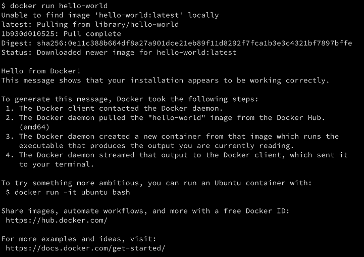

[](../M-01/README.md)
#  Installing Docker for Desktop
If you are using macOS or have Windows 10 Professional installed on your laptop, then we strongly recommend that you install Docker for Desktop. This platform gives you the best experience when working with containers.


- Docker for Desktop is not supported on Linux at this time. Please refer to the Installing Docker CE on Linux section for more details.

- Note that older versions of Windows or Windows 10 Home edition cannot run Docker for Windows. Docker for Windows uses Hyper-V to run containers transparently in a VM but Hyper-V is not available on older versions of Windows; nor is it available in the Home edition of Windows 10. In this case, we recommend that you use Docker Toolbox instead, which we will describe in the next section.

### Download Docker Desktop WIndows 10
 https://www.docker.com/get-started

 Follow these steps:
No matter what OS you're using, navigate to the Docker start page at https://www.docker.com/get-started.
On the right-hand side of the loaded page, you'll find a big blue button saying Download Desktop and Take a Tutorial. Click this button and follow the instructions. You will be redirected to Docker Hub. If you don't have an account on Docker Hub yet, then create one. It is absolutely free, but you need an account to download the software. Otherwise, just log in.
Once you're logged in, look out for this on the page:


Download Docker Desktop on Docker Hub


Note that if you're on a Windows PC, the blue button will say Download Docker Desktop for Windows instead.

### Installing Docker for Desktop on macOS
Follow these steps for installation:

- Once you have successfully installed Docker for Desktop for macOS, please open a Terminal window and execute the following command:
 
***CLI:***
```
docker version
```
You should see something like this:


Docker version on Docker for Desktop
To see whether you can run containers, enter the following command into the terminal window and hit Enter:

***CLI:***
```
docker run hello-world
```
If all goes well, your output should look something like the following:



Running Hello-World on Docker for Desktop for macOS
Next, we will install Docker on Windows.

## Installing Docker for Desktop on Windows
Follow these steps for installation:

- Once you have successfully installed Docker for Desktop for Windows, please open a PowerShell window and execute the following command:

***PowerShell:***
```
docker --version
Docker version 19.03.5, build 633a0ea
```
To see whether you can run containers, enter the following command into the PowerShell window and hit Enter:

***PowerShell:***
```
docker run hello-world
```

If all goes well, your output should look similar to the preceding figure.

## Install WSL 2

- https://docs.microsoft.com/en-us/windows/wsl/install-win10

***PowerShell:***
```
dism.exe /online /enable-feature /featurename:Microsoft-Windows-Subsystem-Linux /all /norestart
dism.exe /online /enable-feature /featurename:VirtualMachinePlatform /all /norestart
wsl -l -v
wsl --set-version ubuntu 2
wsl --set-default-version 2
```
## Install your Linux distribution of choice from Microsoft store

- Ubuntu 16.04 LTS
- Ubuntu 18.04 LTS
- Ubuntu 20.04 LTS
- openSUSE Leap 15.1
- SUSE Linux Enterprise Server 12 SP5
- SUSE Linux Enterprise Server 15 SP1
- Kali Linux
- Debian GNU/Linux
- Fedora Remix for WSL
- Pengwin
- Pengwin Enterprise
- Alpine WSL


## Install Wsl2 Kernel
- https://docs.microsoft.com/en-us/windows/wsl/wsl2-kernel

## Check Version

***PowerShell:***
```powershell
choco --version
git --version
docker --version
```

### Get Code

***PowerShell:***
```powershell
git pull https://github.com/zizo-ro/Docker
```


### Installing Docker CE on Linux

As mentioned earlier, Docker for Desktop is only available for macOS and Windows 10 Pro. If you're using a Linux machine, then you can use the **Docker Community Edition (CE)**, which consists of Docker Engine, plus a few additional tools, such as the **Docker Command Line Interface (CLI)**and **docker-compose**.

Please follow the instructions at the following link to install Docker CE for your particular Linux distribution—in this case, Ubuntu: https://docs.docker.com/install/linux/docker-ce/ubuntu/.


[](#installing-docker-for-desktop)

